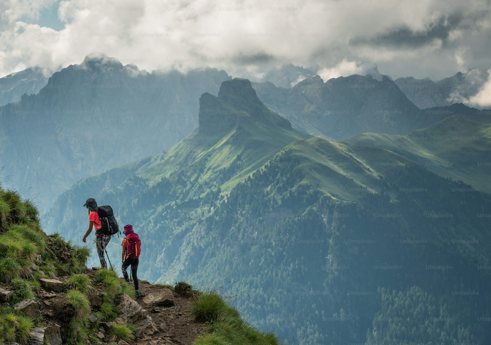

# Anji Reddy Modugula

## Favorite Outdoor Activity: Hiking

Hiking lets me disconnect from screens and reconnect with the natural rhythm of the outdoors. I enjoy the steady climb, the changing terrain, and the quiet moments where only wind and distant bird calls break the silence. It keeps me physically strong while clearing mental clutter—each trail feels like a mini reset that balances challenge and calm.

### Why It Matters To Me
- Builds endurance and resilience
- Encourages presence and mindfulness
- Offers scenic rewards that photos rarely capture

[Back to main README](./README.md)
